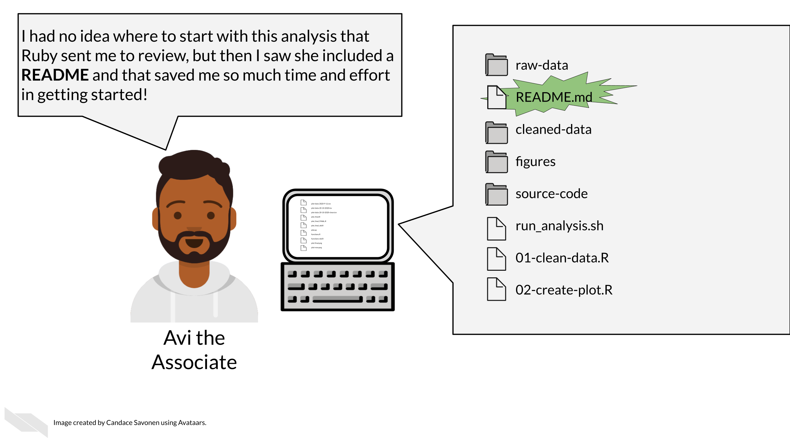

# Creating Clear Documentation

Our goal for documentation is to be as comprehensive, navigable, and as always, as clear as possible.

In this section, we will cover the following learning objectives:

## Characteristics of clear documentation

The following are tips to make your documentation as useful as possible. 

### It is easy to find

No matter how well your documentation is crafted, it is of no use if no one can find them. Having documents that are standard and at the top of your directory is key. READMEs for example are standard documents in software that give the TL;DR of the project. In science, READMEs are incredibly valuable

## It is comprehensive

All items are covered in the documentation in an organized fashion – **every. single. thing.** 

This includes all:

- Data sources and versions
- Metadata
- Software dependencies and their versions
- Terms
- Functions
- Arguments
- Parameters
- Defaults

**The most useful documentation…**

- Not only define the items and files included, but tells how it relates to other items (and they have links where relevant).
- Make any existing defaults and calculations very clear. It doesn’t assume that just because a term is used, the calculation is obvious. For example, Tumor Mutation Burden is a common statistic to report but it is calculated different ways. Documentation should describe major calculations and not assume standardization.
- Shows how to re-run the entire experimental protocol or analysis, example lines of code go a long way.
- Tries to avoid the use of jargon, but if it is absolutely necessary to use a jargon-y term it links to information about the meaning of the term.

### Data formats are described

Perhaps after installation, getting data formatted correctly is one of the other very large hurdles users will need to deal with.

Ideally, your software or analysis can use a data format that is common. But the more that your protocol or tool is particular about an odd data format, the more your documentation needs to be specific about what the odd data format looks like. It’s very helpful to include subsetted, de-identified example files for a positive control/example.

## Types of documentation you should have

Documentation strategies are not one size fits all but there are two types of documentation we strongly advise every project has: READMEs and analysis notebooks.

We refer you to see the OpenPBTA project as a real life example of well documented open source data analysis.

### READMEs!

READMEs are also a great way to help your collaborators get quickly acquainted with the project.

READMEs stick out in a project and are generally universal signal for new people to the project to start by READing them. For code, GitHub automatically will preview your file called “README.md” when someone comes to the main page of your repository which further encourages people looking at your project to read the information in your README.

**Information that should be included in a README:**

1) General purpose of the project
1) Instructions on how to re-run the project
1) Lists of any software required by the project
1) Input and output file descriptions
1) Descriptions of any additional tools included in the project

You can take a look at this [template README](https://raw.githubusercontent.com/jhudsl/Reproducibility_in_Cancer_Informatics/main/resources/README-template.md) to get your started.

#### More about writing READMEs:

- [How to write a good README file](https://www.freecodecamp.org/news/how-to-write-a-good-readme-file/)
- [How to write an awesome README](https://medium.com/data-science/how-to-write-an-awesome-readme-68bf4be91f8b)

### **Exercise: Write a README for your project!**

1) Download this [template README](https://raw.githubusercontent.com/jhudsl/Reproducibility_in_Cancer_Informatics/main/resources/README-template.md).
2) Fill in the questions inside the { } to create a README for this project.
3) See the [R README template](https://github.com/jhudsl/reproducible-R-example) and the [Python README template](https://github.com/jhudsl/reproducible-python-example) for more help if you are writing code for your project.
4) Add your README to your GitHub repository. Follow [these instructions to add files to GitHub repositories](https://docs.github.com/en/repositories/working-with-files/managing-files/adding-a-file-to-a-repository#adding-a-file-to-a-repository-on-github).

### 12.2.3	Notebooks

The generous use and keeping of notebooks is a useful tool for documentation of the development of an analysis or research project.

Data analyses can lead one on a winding trail of decisions and side investigations, but notebooks allow you to narrate your thought process as you travel along these analyses explorations!

**Your scientific notebook should include descriptions that describe:**

### The purposes of the notebook

What scientific question are you trying to answer? Describe the dataset (or samples) you are using to try to answer this and why.

### The reasons behind your decisions

Describe any unconventional method steps or anything that might be forgotten or confusing later or to someone not involved in the study. Note this can be for experimental work or computational data analysis.

For example:

- Describe why a particular code chunk is doing a particular thing – the more odd the code looks, the greater need for you to describe why you are doing it.

- Describe any particular filters or cutoffs you are using and how did you decide on those?

- For data wrangling steps, why are you wrangling the data in such a way – is this because a certain package you are using requires it?

###	Your observations of the results

What do you think about the results? The plots and tables and other visualizations and results that you show in the notebook – how do they inform your original questions?

See this [course about reproducible workflows in R](https://hutchdatascience.org/Tools_for_Reproducible_Workflows_in_R/reproducible-reports.html) for more information about the use of Notebooks to better inform others about your work!

In summary, we've shared some tips for ensuring that your documentation can be as helpful as possible. We suggest that you make it easy to find, comprehensive (describing all aspects of your scientific process), organized (we suggest using a README to help people navigate), and include the reasoning behind your process, especially describing key decision points. We suggest that  notebooks can be especially useful for experimental and computational work.

