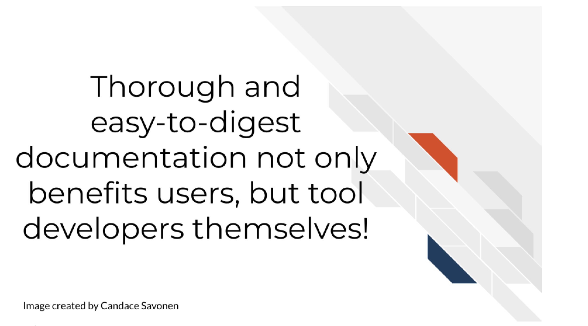

# Why Documentation is Worth the Time

In the following section we will cover the following learning objectives: 

## The context of documentation in research

Biomedical research comes in all shapes and sizes, varying from mostly experimental wet bench work to a combination of experimental and computational, to largely computational. 

Many researchers don't realize the work needed to document computational work to ensure it is reproducible and transparent.

These activities could include:

- Scripts
- Workflows
- Pipelines
- Algorithms and computational methods

Often projects may start with one person developing and using the computational work, but this may expand to other lab members, collaborators, and others in the broader scientific community. 

But many researchers don’t have a computer science background and many are self-taught and may not realize what is needed to document their process.

Research, whether code is involved or not, is an exciting but long process -- filled with side investigations, tedious troubleshooting, but also 'Aha' moments that ultimately can result in amazing results that you should be proud of!

The code and the methods you use are likely valuable to more than just the singular project you made it for. Indeed, others may have needs for the methods you use and will be excited to come across your code and tools!

Other researchers are likely eager to apply your code and methods to their own work but its unfortunately all too common that scientific code is not able to be reused. Even scientists who are skilled with analysis often struggle to make work reproducible. In a large-scale study, only 24% of scientific notebooks ran without errors and only 4.03% produced the same results {@samuel_understanding_2021}.

There is a great need for reproducible work and a large part of reproducibility is clear and findable documentation! Open source code is a valuable practice for contributing to the scientific community, but if the code lacks clear documentation it is incomplete. Undocumented code can lead to a lot of frustration and time inefficiently spent.

If a code base's documentation is non-existent, scarce, out-of-date, or filled with too much jargon, the chances are high that no one will be able to successfully and efficiently re-use this work, despite their needs to do so.

Lack of usability often leads researchers to ditch even the most well-programmed of tools and code.

This is the unfortunate and all-too-common result of many bioinformatics tools.

## Why documentation is worth the time

We realize many researchers feel unenthused about the process of creating documentation or may lack bandwidth to do so. They may know it's good for their research, but they just aren't enthused about it.

We'd like to assure you that the effort for creating good documentation has a high return payoff for the continued success of your research methods/code/scientific software as a whole!

Other researchers are still likely to encounter errors and problems, but with thorough and easy-to-digest documentation, they are better equipped to troubleshoot these problems! They may also learn more about the features and limitations of the code/methods that will better guide their next steps!

This is not only helpful for other researchers, but makes it more likely that more individuals in the community will use these methods and share them in the community. These types of citations and usage metrics can be valuable to report to funding institutions to describe the impact of the work.

Well-documented code helps developers better maintain their code in the future because they may forget the mechanics of their code over time.

This helps with manuscript revisions or future research that builds on these methods!

In summary, all research should have good documentation, regardless of if it is mainly experimental wet bench science or mainly computational. Keeping good records of reagents, experimental protocols, software, methods, and more can help to ensure that our science is as transparent and rigorous as possible. It can also help speed up efficiency both within our own labs and for collaborators who wish to use our data or methods.  
