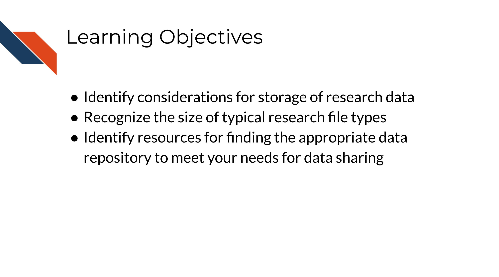
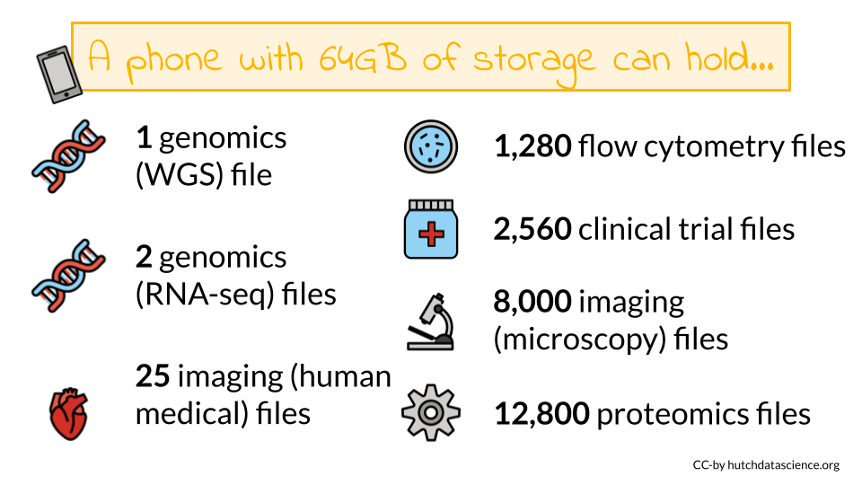
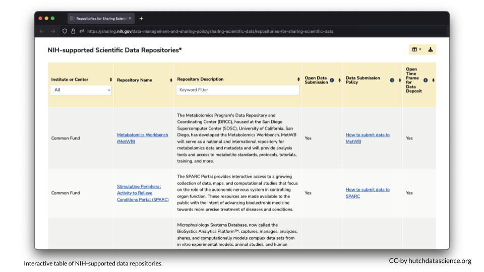
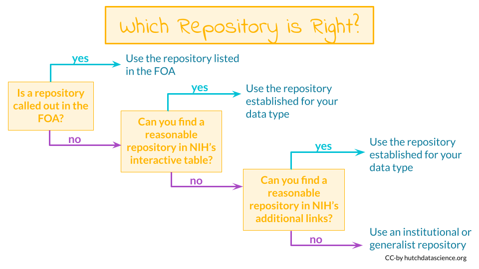

# Data Storage and Data Repositories

To enable a more productive research experience and to ease your future compliance with any data sharing requirements, active data management during the research process can be very helpful.  

In this section we will cover the following learning objectives:

## Data Storage Concerns

How should you store and interact with data while doing research?

Your data storage needs will depend greatly on the type of data you will be working with as well as the number of samples you might have. File sizes vary considerably based on the data being stored. A single file can be as small as 1 MB in size (for a PET scan image of the heart) to 60 GB (for an uncompressed fastq of a whole genome sequence). Storing files in a compressed format, especially raw files, can help decrease your storage needs and costs. Below is a table of common types of data and sizes for single files. This list is not comprehensive but instead should be taken as a general guide. You should always get a more specific estimate for your particular project before submitting your grant proposal.

| **Type of data** | **Common size for a _single_ file** |
|------------------|------------------|
| Genomics (WGS, WES) |	15-60 GB |
| Genomics (RNA-seq, scRNA-seq)| 3-25 GB |
| Imaging (microscopy) | 2-8 MB |
| Imaging (human medical) | 1 MB – 2.5 GB |
| Flow cytometry |	1-50 MB |
| Proteomics | 3-5 MB |
| Clinical trials | 2-25 MB |

As you can see some of these data types require large data files. These files may quickly add up to require more storage or computing capacity than your laptop (which typically have 250 GB-1 TB of storage)! If you want to learn more about data file sizes check out the [data file size details section](https://hutchdatascience.org/NIH_Data_Sharing/data-file-size-details.html) of the appendix and this class on [Computing for Cancer Informatics](https://jhudatascience.org/Computing_for_Cancer_Informatics/index.html) from the [Informatics Technology for Cancer Research (ITCR)](https://itcr.cancer.gov/) [Training Network (ITN)](https://www.itcrtraining.org/) for options on how to manage large data files.

## Data Repositories

Where will I share my data? What repositories exist that might work for my data type?

Some programs or Funding Opportunity Announcements (FOA) will specify where the data should be shared. If this applies, you should plan to use the repositories mentioned in the FOA.

Other programs or FOAs will not specify where the data should be shared, however the NIH provides an [interactive table of NIH-supported data repositories](https://sharing.nih.gov/data-management-and-sharing-policy/sharing-scientific-data/repositories-for-sharing-scientific-data) to help you identify repositories that might be appropriate for your data.

If you don't find a repository there, additional repositories can also be found at the following links:

- [Open NIH-supported domain-specific repositories](https://www.nlm.nih.gov/NIHbmic/domain_specific_repositories.html)
- [Other NIH-supported domain-specific resources](https://www.nlm.nih.gov/NIHbmic/other_data_resources.html)
- [Nature data sharing resources](https://www.nature.com/sdata/policies/repositories)
- [Registry of research data repositories](https://www.re3data.org/)

Researchers should aim to find a repository with the following characteristics according to the NIH:

- **Established**: If the repository is established (well-known or has been around for a significant period of time), it is likely to improve the FAIRness [@wilkinson_citation_2016] of the data.
- **Specific**: Repositories that are discipline or data-type specific should be prioritized to promote reuse.
- **Unique Persistent Identifiers**: Assigns datasets a citable, unique persistent identifier, such as a digital object identifier (DOI) or accession number, to support data discovery, reporting, and research assessment. The identifier points to a persistent landing page that remains accessible even if the dataset is de-accessioned or no longer available.
- **Long-Term Sustainability**: Has a plan for long-term management of data, including maintaining integrity, authenticity, and availability of datasets; building on a stable technical infrastructure and funding plans; and having contingency plans to ensure data are available and maintained during and after unforeseen events.
- **Metadata**: Ensures datasets are accompanied by metadata to enable discovery, reuse, and citation of datasets, using schema that are appropriate to, and ideally widely used across, the community/communities the repository serves. Domain-specific repositories would generally have more detailed metadata than generalist repositories.
- **Curation and Quality Assurance**: Provides, or has a mechanism for others to provide, expert curation and quality assurance to improve the accuracy and integrity of datasets and metadata.
- **Free and Easy Access**: Provides broad, equitable, and maximally open access to datasets and their metadata free of charge in a timely manner after submission, consistent with legal and ethical limits required to maintain privacy and confidentiality, Tribal sovereignty, and protection of other sensitive data.
- **Broad and Measured Reuse**: Makes datasets and their metadata available with broadest possible terms of reuse; and provides the ability to measure attribution, citation, and reuse of data (i.e., through assignment of adequate metadata and unique identifiers).
- **Clear Use Guidance**: Provides accompanying documentation describing terms of dataset access and use (e.g., particular licenses, need for approval by a data use committee).
- **Security and Integrity**: Has documented measures in place to meet generally accepted criteria for preventing unauthorized access to, modification of, or release of data, with levels of security that are appropriate to the sensitivity of data.
- **Confidentiality**: Has documented capabilities for ensuring that administrative, technical, and physical safeguards are employed to comply with applicable confidentiality, risk management, and continuous monitoring requirements for sensitive data (should your data require such safeguards).
- **Common Format**: Allows datasets and metadata downloaded, accessed, or exported from the repository to be in widely used, preferably non-proprietary, formats consistent with those used in the community/communities the repository serves.
- **Provenance**: Has mechanisms in place to record the origin, chain of custody, and any modifications to submitted datasets and metadata.
- **Retention Policy**: Provides documentation on policies for data retention within the repository.

## Considerations for Human Data

When working with human participant data, including de-identified human data, here are some additional characteristics to look for:

- **Fidelity to Consent**: Uses documented procedures to restrict dataset access and use to those that are consistent with participant consent and changes in consent.
- **Restricted Use Compliant**: Uses documented procedures to communicate and enforce data use restrictions, such as preventing reidentification or redistribution to unauthorized users.
- **Privacy**: Implements and provides documentation of measures (for example, tiered access, credentialing of data users, security safeguards against potential breaches) to protect human subjects data from inappropriate access.
- **Plan for Breach**: Has security measures that include a response plan for detected data breaches.
- **Download Control**: Controls and audits access to and download of datasets (if download is permitted).
- **Violations**: Has procedures for addressing violations of terms-of-use by users and data mismanagement by the repository.
- **Request Review**: Makes use of an established and transparent process for reviewing data access requests.

**Data FAIRness**

Data that is **F**indable, **A**ccessible, **I**nteroperable, and **R**eusable. For more information about data FAIRness, check out this [manuscript](https://www.nature.com/articles/sdata201618) by @wilkinson_citation_2016.

In brief, it is described by the [NIH](https://datascience.nih.gov/sites/default/files/NIH_Strategic_Plan_for_Data_Science_Final_508.pdf) as follows:

- To be Findable, data must have unique identifiers, effectively
labeling it within searchable resources.
- To be Accessible, data must be easily retrievable via open systems
and effective and secure authentication and authorization
procedures.
-  To be Interoperable, data should “use and speak the same
language” via use of standardized vocabularies.
- To be Reusable, data must be adequately described to a new user,
have clear information about data-usage licenses, and have a
traceable “owner’s manual,” or provenance.

## No Existing Repository?

What if I can't find an appropriate repository?

- **Supplemental material** - If the data are small (less than 2 GB), it may be included as supplemental material for an article. See [here](https://www.ncbi.nlm.nih.gov/pmc/about/guidelines/#suppm) for more information.

- **Institutional repositories** - Check to see if your institute has a repository where you could publicly share the data
- **[Generalist repositories](https://www.nlm.nih.gov/NIHbmic/generalist_repositories.html)**- Host your data somewhere that hosts different types of data publicly, such as:

    - [Dataverse](https://dataverse.org/)
    - [Dryad](https://datadryad.org/)
    - [Figshare](https://figshare.com/)
    - [IEEE Dataport](https://ieee-dataport.org/)
    - [Mendeley Data](https://data.mendeley.com/)
    - [Open Science Framework](https://osf.io/)
    - [Synapse](https://www.synapse.org/)
    - [Vivli](https://vivli.org/)
    - [Zenodo](https://zenodo.org/)

Note that the NIH encourages that an existing data sharing repository be used whenever one is available instead of one of these options.

## Data repositories

The best way to share your data is by putting it somewhere that others can download it (and it can be kept private when necessary). There's many repositories out there that handle this for you.

Below are some of the standard repositories for data you should consider.

**For a longer list of repositories, we also advise consulting this [Nature guidance on data repositories](https://www.nature.com/sdata/policies/repositories).**

### Genomic Data Repositories

- [National Center for Biotechnology Information (NCBI)](https://www.ncbi.nlm.nih.gov/)
  - For microarray: [GEO Gene Expression Omnibus (GEO)](https://www.ncbi.nlm.nih.gov/geo/info/submission.html)
  - For RNA-seq: [SRA (Sequencing Read Archive)](https://www.ncbi.nlm.nih.gov/sra/docs/submit/)
- [European Molecular Biology Laboratory-European Bioinformatics Institute (EMBL-EBI)](https://www.ebi.ac.uk/submission/)
- [International Nucleotide Sequence Databases—DNA Data Bank of Japan (DDBJ)](https://www.ddbj.nig.ac.jp/ddbj/submission-e.html)

### Imaging data repositories

- [Imaging data resource](https://idr.openmicroscopy.org/)
- [Cancer imaging archive](https://www.cancerimagingarchive.net/primary-data/)

### Repositories for journal articles

For manuscripts or large datasets that are of atypical format, using one of these repositories is a good idea.
The journal you submit to may have a recommendation of one over another. If not, you might end up having a preference.

- [CyVerse Data Commons Repository](https://cyverse.org/data-commons)
- [Data Dryad](https://datadryad.org/stash)
- [FigShare](https://info.figshare.com/user-guide-category/uploading-and-managing-files/)
- [ZENODO](https://help.zenodo.org/)

### Small datasets

Data sets that are small and atypical in format can be published as supplementary files as a part of a manuscript.

## Summary of resources: Finding a repository

The following links can help you find a data repository for your data:

- [Interactive table of NIH-supported data repositories](https://sharing.nih.gov/data-management-and-sharing-policy/sharing-scientific-data/repositories-for-sharing-scientific-data) *Start here!*
- [Open NIH-supported domain-specific repositories](https://www.nlm.nih.gov/NIHbmic/domain_specific_repositories.html)
- [Other NIH-supported domain-specific resources](https://www.nlm.nih.gov/NIHbmic/other_data_resources.html)
- [Nature data sharing resources](https://www.nature.com/sdata/policies/repositories)
- [Registry of research data repositories](https://www.re3data.org/)

If you don't find an appropriate repository for your data type:

- Consider adding your data as a supplementary file to a manuscript if it is small
- Consider an institutional repository
- Check out the [generalist repositories](https://www.nlm.nih.gov/NIHbmic/generalist_repositories.html)

In summary, the NIH has resources to help you find the appropriate repository for your particular data. There are many repositories designed for specific types of data and or specific data uses. If you can't find an appropriate repository, consider using a repository that can be used for multiple types of data (aka a generalist repository), such as Dataverse, Dryad, Figshare, or Zenodo (see the link above for NIH suggested options). 
