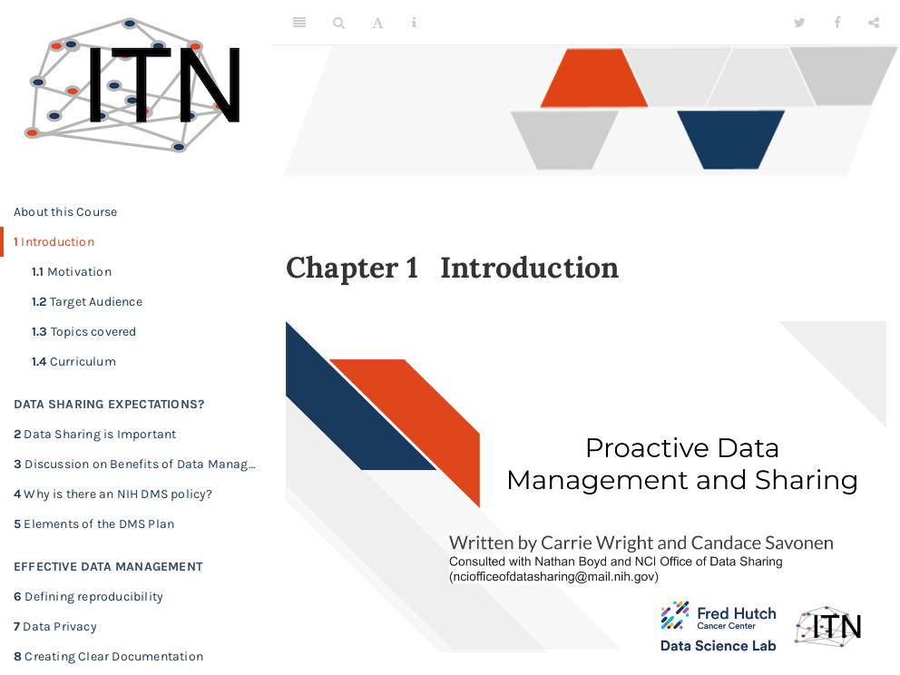

# 1 Introduction
 

Click [here](https://hutchdatascience.org/Proactive_Data_Management_and_Sharing/no_toc/introduction.html) to go to the course content.

{quiz, id: quiz_data_sharing, attempts: 10}

## Data Sharing Importance Quiz

Choose the best answer.

{choose-answers: 4}
? What are reasons why data sharing is useful?

C) All of the other answers are reasons
C) All of the other answers
m) Your work is more transparent
m) Science can advance faster as some analysis are useful with existing data
o) Your work is more likely to get cited
o) You don't have to deal with requests for your data
o) More people can work with your data to maximize its potential use
o) Others are more likely to trust your analysis
o) It is more economical 

{choose-answers: 4}
? How does data sharing advance science?

C) All of the answers are ways data sharing helps advance science
C) All of the answers are correct
m) Additional studies on the same data can be done faster than if the were to create new data every time 
m) Researchers at institutions with limited resources can contribute more by performing more economical studies where the can reuse data rather than create it
o) Scientific research is more transparent, helping others understand more about what was previously done
o) Scientific research is more reproducible

{/quiz}
