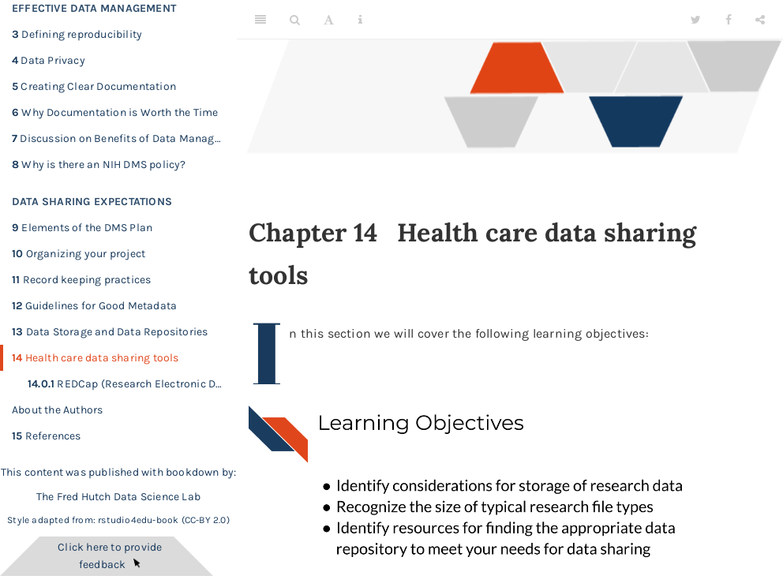

# 14 Health care data sharing tools
 

Click [here](https://hutchdatascience.org/Proactive_Data_Management_and_Sharing/no_toc/health-care-data-sharing-tools.html) to go to the course content.
 

{quiz, id: quiz_health_care_data_sharing_tools, attempts: 10}

## Heath care data sharing tools Quiz

Choose the best answer.

{choose-answers: 4}
? What methods can be helpful in keeping data secure with REDCap?

C) All of the other answers are methods that can be helpful
C) All of the other answers
m) Always check with your institution about guidelines for REDCap usage and verify your plans with your local internal review board before use
m) You can set roles to restrict access and tasks that could change the data
o) Reports can be generated that don't share data that should be kept private
o) You can keep track of all data modifications, exports, and report generations, as well as who did them
o) You can lock your data so that changes can't be made

{/quiz} 
