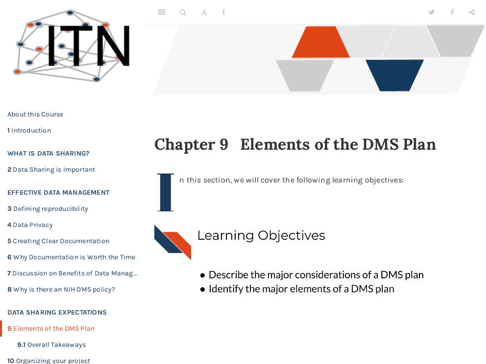

# 4 Elements of the DMS Plan
 
 

Click [here](https://hutchdatascience.org/Proactive_Data_Management_and_Sharing/no_toc/elements-of-the-dms-plan.html) to go to the course content.

{quiz, id: quiz_dms_elements, attempts: 10}

## Elements of the DMS Plan Quiz

Choose the best answer.

{choose-answers: 4}
? What are the major elements of a DMS plan?

C) All of the other answers are elements
C) All of the other answers
m) Information about the data type to be generated and shared
m) Information about the data amount to be generated and shared
o) Tools, software, and code use to work with the data
o) Data timelines
o) Data access considerations
o) oversight plan

{choose-answers: 4}
? How does one budget for sharing data?

C) You can request as direct costs (unless it is infrastructure)
C) Costs can be included as direct costs (unless it is infrastructure)
m) You don't have to budget for data sharing costs
m) Discretionary funds should be used
o) Data sharing is always free
o) Contact the data sharing budget office

{/quiz}
