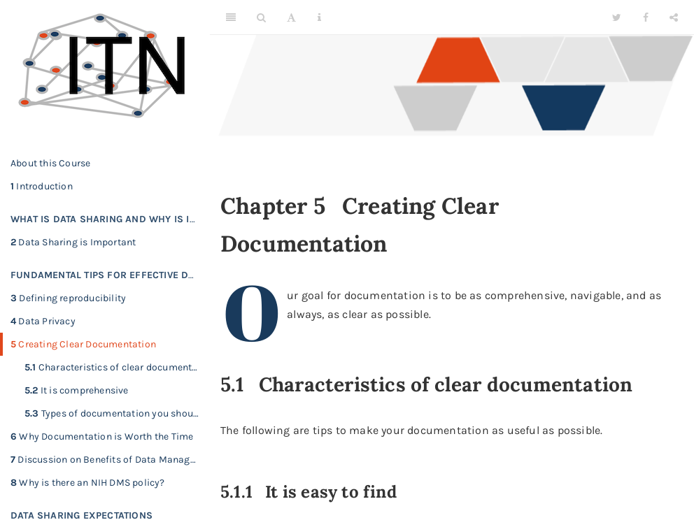

# 8 Creating Clear Documentation

 

Click [here](https://hutchdatascience.org/Proactive_Data_Management_and_Sharing/no_toc/creating-clear-documentation.html) to go to the course content.

 
{quiz, id: quiz_clear_documentation, attempts: 10}

Clear Documentation Quiz
Choose the best answer.

{choose-answers: 4} 
? Which are characteristics of clear documentation?

C) All of the options are characteristics of clear documentation C) All of the answers are characteristics of clear documentation m) It is comprehensive m) It is easy to find o) Unusual data formats or steps are described o) Describes the reasoning behind decisions

{choose-answers: 4} 
? What is NOT true about a README file?

C) They don't help readers navigate to information they need C) They don't help others understand the goals of the project m) They allow people to quickly get a sense of what is happening with the project m) They enable people to find files or other aspects related to the project o) They describe necessary tools that are used in the project o) They explain the inputs and outputs

{/quiz}
 
